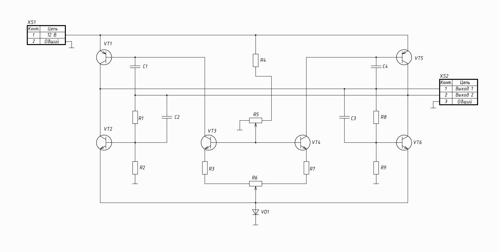
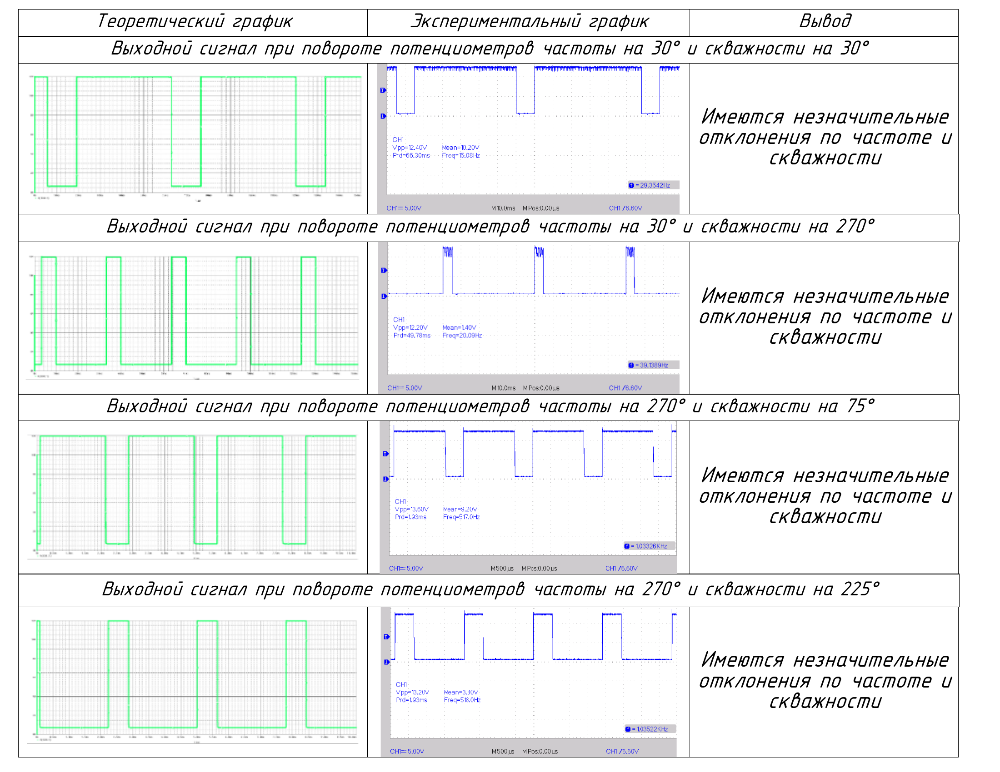
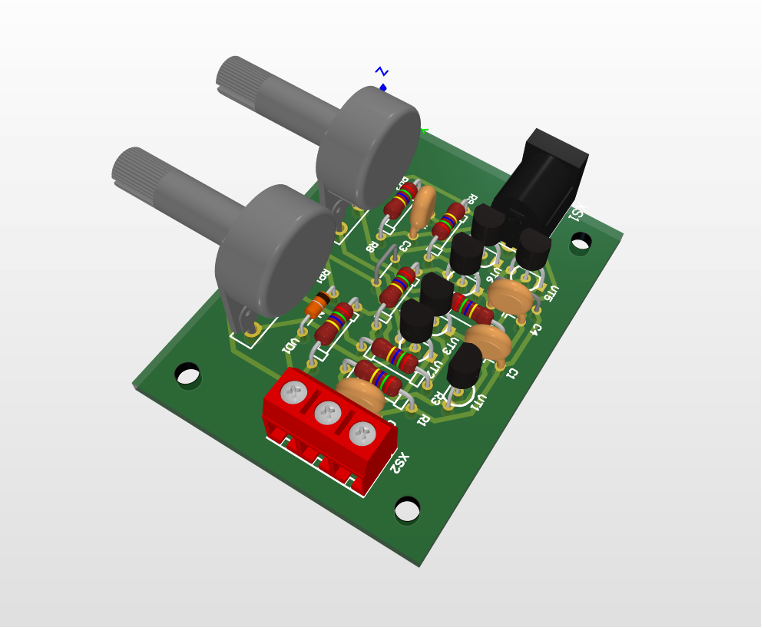
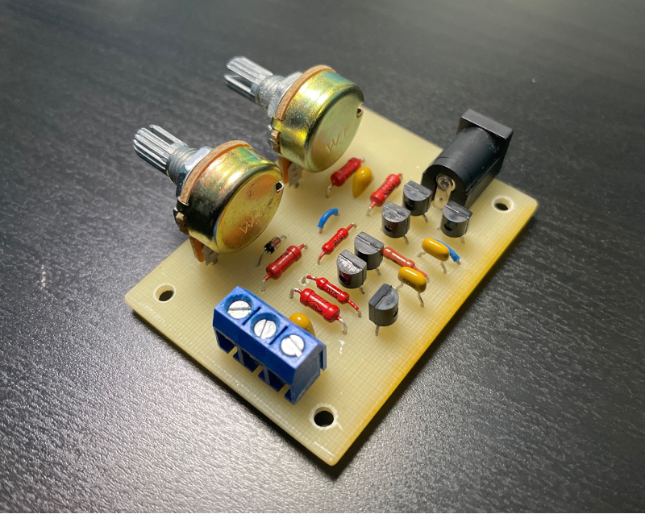

# Перестраиваемый генератор прямоугольных импульсов

Проект разработан в рамках курсовой работы на кафедре "Проектирование и технология производства электронной аппаратуры" МГТУ им. Н.Э. Баумана. Устройство позволяет генерировать прямоугольные импульсы с регулируемой частотой и скважностью.

## О проекте
**Цель:** Разработка, моделирование и экспериментальное исследование генератора прямоугольных импульсов с возможностью точной настройки параметров сигнала.  
**Основные этапы:**
1. Схемотехническое проектирование (структурная и принципиальная схемы).
2. Моделирование работы в PSpice 16.3.
3. Конструкторско-технологическое проектирование (топология печатной платы, 3D-модель).
4. Изготовление и монтаж устройства.
5. Экспериментальная проверка характеристик.

**Используемые технологии и ПО:**
- Altium Designer — проектирование схем и печатных плат.
- Компас 3D — проектирование конструкторской документации.
- PSpice 16.3 — моделирование электронных схем.
- ЕСКД — единая система конструкторской документации.
- Осцилограф — отладка устройства.

## Характеристики устройства
- **Регулируемые параметры:** Частота (до 1 кГц) и скважность (от 2 до 5).
- **Печатная плата:** Односторонняя (60×45 мм), стеклотекстолит СФ-2Н-35Г.

## Результаты
- **Принципиальная электрическая схема:**
  
- **Эксперимент:**
  
- **3D модель устройства:**
  
- **Устройство:**
  